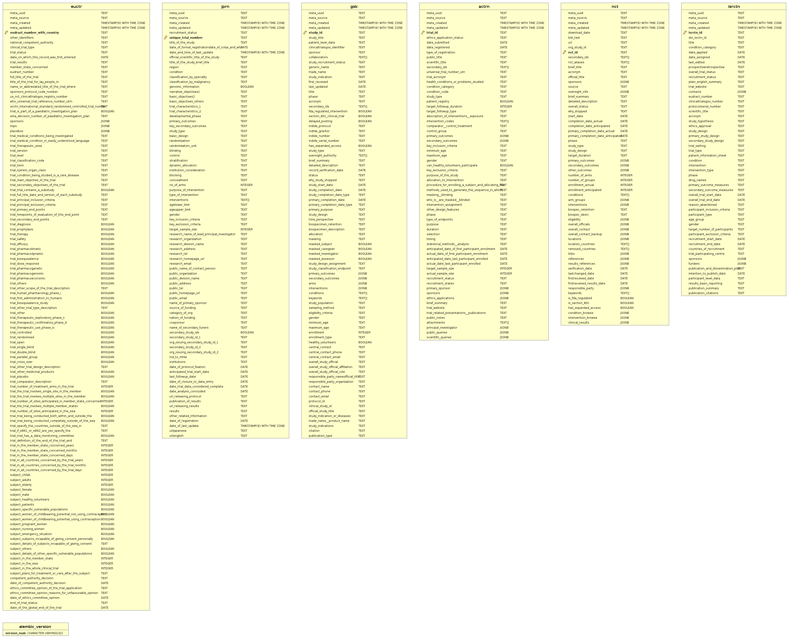

# Warehouse

The document describes OpenTrials `warehouse`.

> Last updated on migration: [20160220212552](https://github.com/opentrials/collectors/blob/master/migrations/versions/20160220212552_nct_fix_boolean_columns.py).

## Data Model

### Basics

This database stores `records` collected from different source.
It's a denormalized data storage.

### Tables

This database uses table per source approach.

### ER Diagram

### Technology

Database engine: `postgresql-9.4+`.
